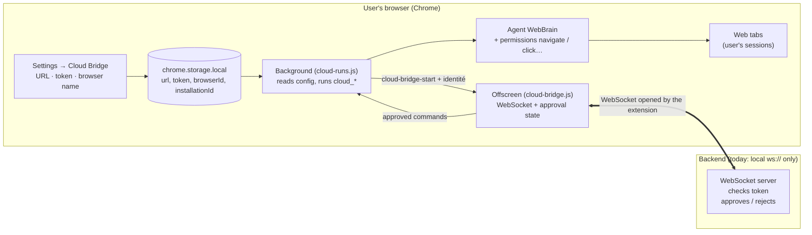

# Cloud Bridge browser registration & approval

A backend can require explicit approval of a WebBrain installation before it is allowed to run `cloud_*` commands. The feature is opt-in: **without a Cloud Bridge token the bridge behaves exactly as before** (local MCP server, no approval step).

## Architecture

```
background (cloud-runs.js)  --cloud-bridge-start {url, token, browserId, installationId, extensionVersion}-->  offscreen (cloud-bridge.js)  <== WebSocket ==>  backend
```



The French guide ([cloud-bridge-test-guide.fr.md](cloud-bridge-test-guide.fr.md)) also has a message-sequence diagram.

**Chrome vs Firefox.** Chrome (MV3) hosts the socket in an offscreen document (`src/chrome/src/offscreen/cloud-bridge.js`). Firefox (MV2) has no offscreen documents, so `src/firefox/src/cloud-bridge.js` is a module that runs in the persistent background page and hands commands directly to `handleMessage`. The protocol, storage keys, approval rules and Settings tab are identical; `src/firefox/src/cloud-runs.js` mirrors the Chrome controller and receives the bridge as an injected dependency.

- `cloud-runs.js` reads the persistent identity from `chrome.storage.local` and passes it to the offscreen page with the existing `cloud-bridge-start` message (the offscreen page has no storage access).
- `offscreen/cloud-bridge.js` sends the enriched `hello` and tracks the approval state **per socket**.
- Command routing (`cloud_run`, `cloud_status`, `cloud_respond`, `cloud_abort`, workflows, scheduled jobs) and payloads are unchanged.

## Local configuration

Keys in `chrome.storage.local` (the existing mechanism; the URL and enable toggle are already in Settings):

| Key | Meaning |
| --- | --- |
| `webbrainCloudBridgeEnabled` | existing toggle |
| `webbrainCloudBridgeUrl` | existing, `ws://` on localhost only |
| `webbrainCloudBridgeToken` | Cloud Bridge credential. Distinct from provider API keys. Setting it turns approval on. |
| `webbrainCloudBridgeBrowserId` | Backend-visible name; defaults to the installation id |
| `webbrainCloudBridgeInstallationId` | Generated once (`crypto.randomUUID()`) |

All of these are editable in **Settings → Cloud Bridge**: enable toggle, backend URL, token, browser name (`browserId`), the read-only installation ID, and a **Save & test connection** button. The test saves the form, (re)starts the bridge and reports one of: backend unreachable, connected (no approval needed), waiting for approval, approved, or rejected (with the reason).

To try it end to end: run `node examples/cloud-bridge-approval-server.mjs --token dev-token`, enter `dev-token` in the tab, press **Save & test connection** (status: waiting for approval), then type `approve` in the server terminal (status: approved) or `reject`.

The older Display → MCP block controls the same enable/URL keys; it is not refreshed live when the new tab changes them (reload Settings).

Changing the token or browserId reconnects the socket.

## Messages

Extension → backend, on every socket open:

```json
{
  "type": "hello",
  "client": "webbrain-extension",
  "protocolVersion": 2,
  "capabilities": ["saved_workflows_v1", "run_modes_v1", "scheduled_jobs_v1"],
  "auth": { "type": "bearer", "token": "dev-token" },
  "browserId": "my-laptop",
  "installationId": "0b0c6a3e-…",
  "browser": { "name": "Chrome", "version": "126.0.0.0" },
  "extensionVersion": "38.0.13",
  "platform": "Linux x86_64",
  "status": { "enabled": true, "approval": "pending", "…": "…" }
}
```

`auth`, `browserId` and `installationId` are only sent when a token is configured. The token is never included in `status`.

Backend → extension:

```json
{ "type": "connection_pending",  "browserId": "my-laptop" }
{ "type": "connection_approved", "browserId": "my-laptop" }
{ "type": "connection_rejected", "browserId": "my-laptop", "reason": "Rejected by user" }
```

- `browserId` is optional; if present and different from the local one, the message is ignored.
- `connection_rejected` closes the socket and **stops auto-reconnect** until the settings change or the bridge is restarted.

Until `connection_approved`, any `cloud_*` command gets (and is not forwarded to the background):

```json
{ "id": "c1", "ok": false, "error": "Connection not approved", "code": "connection_not_approved", "status": 403 }
```

After approval, commands are exactly the existing format:

```json
{ "id": "c2", "action": "cloud_status", "payload": { "runId": "run_123" } }
```

`status().approval` is one of `not_required | pending | approved | rejected`.

## Reconnection

Approval belongs to one WebSocket. Every new socket (reconnect, URL/identity change) starts `pending`, resends `hello`, and must be approved again.

## Local test server

`examples/cloud-bridge-approval-server.mjs` is a dependency-free backend for testing:

```bash
node examples/cloud-bridge-approval-server.mjs --token dev-token          # manual approval
node examples/cloud-bridge-approval-server.mjs --token dev-token --auto-approve
```

It replies `connection_pending` after a valid `hello` (or `connection_rejected` for a bad token). On stdin, type `approve`, `reject`, or `send {"id":"1","action":"cloud_status","payload":{"runId":"run_x"}}`.

Automated tests (unit with a fake WebSocket + one end-to-end run against that server):

```bash
npm run test:cloud-bridge-approval
```

## Limits & security

- The bridge URL is still restricted to `ws://` on localhost/127.0.0.1/::1. A remote backend needs a local relay, or a deliberate relaxation (needs TLS and a decision upstream).
- The token travels in the `hello` over that local socket; it is stored in plain `chrome.storage.local` like other settings.
- The backend is responsible for validating the token and for the user-facing approval UI; the extension only enforces "no approval, no commands".
- The extension still only accepts the `cloud_*` run actions; no cookies, tabs, history, provider keys or configuration are exposed.
- Approval is not persisted and not revocable from the extension side other than by disabling the bridge or rotating the token.
