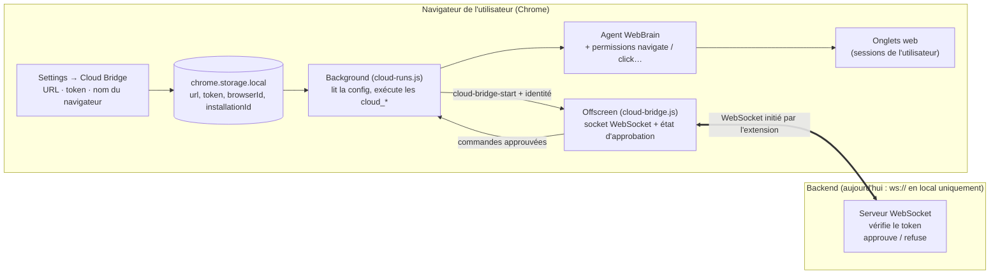
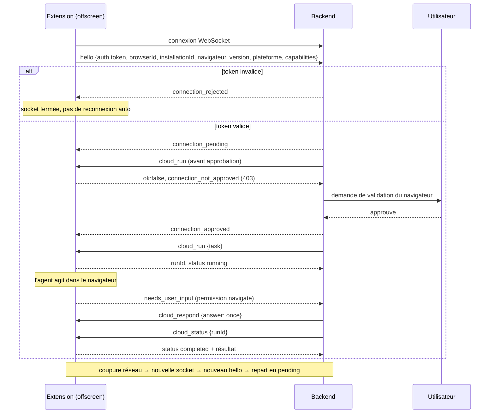

# Guide de test (FR) — Cloud Bridge : enregistrement et approbation du navigateur

Guide pas à pas pour installer l'extension en mode développeur et tester la feature de bout en bout. Pour la description technique du protocole, voir [cloud-bridge-browser-approval.md](cloud-bridge-browser-approval.md).

## Schémas

### Architecture



### Échange de messages



## 1. Prérequis

- Node.js 22 ou plus (`node -v`)
- Google Chrome (ou Chromium)
- Le dépôt, sur la branche de la feature :

```bash
cd ~/Documents/webbrain
git checkout feat/cloud-bridge-browser-approval
npm ci --ignore-scripts      # une seule fois, installe les dépendances de dev
```

## 2. Installer l'extension en mode développeur

L'extension Chrome est directement chargeable depuis `src/chrome` (pas de build nécessaire).

1. Ouvrir `chrome://extensions`.
2. Activer **Mode développeur** (interrupteur en haut à droite).
3. Cliquer sur **Charger l'extension non empaquetée**.
4. Sélectionner le dossier `~/Documents/webbrain/src/chrome` (celui qui contient `manifest.json`).
5. WebBrain apparaît dans la liste. Épingler l'icône dans la barre d'outils si besoin.

> Après chaque modification du code : sur `chrome://extensions`, cliquer sur l'icône ↻ de WebBrain, puis recharger la page Settings.

Alternative (copie construite) : `npm run build:chrome` génère `build/chrome`, à charger de la même façon.

## 3. Lancer le serveur de test local

Dans un terminal (le laisser ouvert) :

```bash
cd ~/Documents/webbrain
node examples/cloud-bridge-approval-server.mjs --token dev-token
```

Vous devez voir : `Listening on ws://127.0.0.1:17374/extension`.

Options : `--port 17374` (défaut), `--auto-approve` (approuve automatiquement, pratique pour tester les commandes).

Ce terminal sert à la fois de **backend** (il affiche tout ce que l'extension envoie, préfixé par `<-`) et de **console d'approbation**.

## 4. Configurer l'extension

1. Ouvrir les Settings de WebBrain (clic droit sur l'icône → Options, ou la roue dentée du panneau latéral).
2. Aller dans l'onglet **Cloud Bridge**.
3. Remplir :
   - **Backend WebSocket URL** : `ws://127.0.0.1:17374/extension` (seul `ws://` en local est accepté)
   - **Cloud Bridge token** : `dev-token` (le même que `--token` du serveur)
   - **Browser name** : par exemple `mon-chrome` (optionnel ; sinon l'ID d'installation sert de nom)
4. Cliquer sur **Save & test connection** (cela active aussi l'interrupteur).

Le statut passe à : *Connected — waiting for the backend to approve this browser.*

Dans le terminal du serveur, vous voyez le `hello` reçu, par exemple :

```json
{"type":"hello","client":"webbrain-extension","protocolVersion":2,
 "capabilities":["saved_workflows_v1","run_modes_v1","scheduled_jobs_v1"],
 "auth":{"type":"bearer","token":"dev-token"},
 "browserId":"mon-chrome","installationId":"…",
 "browser":{"name":"Chrome","version":"…"},"extensionVersion":"38.0.13","platform":"Linux", …}
```

## 5. Scénarios à tester

### A. Commande avant approbation (doit être refusée)

Dans le terminal du serveur, taper :

```
send {"id":"1","action":"cloud_status","payload":{"runId":"x"}}
```

Réponse attendue (affichée par le serveur) :

```json
{"id":"1","ok":false,"error":"Connection not approved","code":"connection_not_approved","status":403}
```

### B. Approbation, puis commande

```
approve
```

Le statut dans Settings devient *Connected and approved.* (il se rafraîchit toutes les 2 s). Puis :

```
send {"id":"2","action":"cloud_status","payload":{"runId":"x"}}
```

Réponse attendue : `"ok":false,"error":"Unknown cloud run."` — c'est normal, le run `x` n'existe pas ; ce qui compte est que la commande a **atteint** WebBrain (plus de `connection_not_approved`).

Pour lancer un vrai run, voir le format existant de `cloud_run` dans la doc technique (même payload qu'avant la feature).

### C. Refus

Dans le terminal : `reject`. Le statut devient *Rejected by the backend: …*, la socket est fermée et l'extension **ne se reconnecte plus** toute seule. Pour réessayer : **Save & test connection**.

### D. Reconnexion

1. Arrêter le serveur (Ctrl+C) puis le relancer : l'extension se reconnecte automatiquement (délai croissant, jusqu'à 30 s).
2. Elle renvoie un `hello`, et la connexion est de nouveau **en attente** : toute commande est refusée tant que vous n'avez pas retapé `approve`.

Note connue : juste après une reconnexion, le texte de statut de la page Settings peut rester sur « approved » alors que la connexion est repassée en attente ; les commandes sont bien refusées. Cliquer sur **Save & test connection** pour resynchroniser l'affichage.

### E. Mauvais token

Mettre un autre token dans Settings puis **Save & test connection** : le serveur répond `connection_rejected` (« Invalid token »).

### F. Mode historique (sans token)

Vider le champ token et sauvegarder : plus aucune approbation n'est exigée, le comportement est celui d'avant la feature (serveur MCP local inchangé). Le serveur de test ne l'acceptera pas (il exige un token) ; ce mode se teste avec le serveur MCP du dépôt (`mcp-server/`).

## 6. Inspecter / déboguer

- **Console du service worker** : `chrome://extensions` → WebBrain → *service worker* → Console.
- **Voir la config stockée** (même console) :

```js
chrome.storage.local.get(null, v => console.log(
  Object.fromEntries(Object.entries(v).filter(([k]) => k.startsWith('webbrainCloudBridge')))))
```

- **Statut du bridge** : dans cette console, `chrome.runtime.sendMessage({target:'background', action:'cloud_bridge_status'}).then(console.log)` — renvoie `approval` (`not_required | pending | approved | rejected`), jamais le token.
- **Repartir de zéro** : `chrome.storage.local.remove(['webbrainCloudBridgeToken','webbrainCloudBridgeBrowserId','webbrainCloudBridgeInstallationId','webbrainCloudBridgeEnabled'])`.

Problèmes fréquents :

| Symptôme | Cause probable |
| --- | --- |
| *Backend unreachable* | Le serveur n'est pas lancé, mauvais port, ou URL autre que `ws://127.0.0.1/localhost` |
| Rien ne change après modification du code | Extension non rechargée (↻ sur `chrome://extensions`) |
| Reste « Rejected » | Normal : pas de reconnexion auto après un refus, cliquer sur **Save & test connection** |
| Port 17374 déjà utilisé | Un serveur MCP tourne déjà : l'arrêter ou utiliser `--port` (et changer l'URL dans Settings) |

## 7. Tests automatisés

```bash
npm run test:cloud-bridge-approval   # 9 tests : hello, pending, approved, rejected, commande avant/après, reconnexion, mode sans token, e2e vs serveur d'exemple
node test/run.js                     # suite complète existante (≈ 2400 tests)
```

## 8. Bonnes pratiques de sécurité pour vos essais

- Utilisez un token de test (`dev-token`), jamais une vraie clé API de provider : le token du Cloud Bridge est distinct.
- Le token est stocké en clair dans `chrome.storage.local` et envoyé dans le `hello` (en local uniquement).
- Le serveur d'exemple est un outil de test local, pas un backend de production.

## 9. Test réel : lancer une vraie tâche (`cloud_run`)

Pré-requis côté WebBrain : un **provider LLM configuré** (onglet Providers, avec sa clé API) et un onglet web ouvert (le run s'exécute dans l'onglet actif). Les permissions habituelles de WebBrain s'appliquent comme pour un utilisateur humain.

Avec le serveur d'exemple, après `approve` :

```
run Ouvre example.com et dis-moi le titre de la page
status                      # liste les runs
status run_xxxxx            # état d'un run (l'id est dans la réponse de cloud_run)
```

`run <texte>` envoie `{"action":"cloud_run","payload":{"task":"<texte>","mode":"act"}}` ; la réponse contient un `runId` et `status: "running"`. Interrogez ensuite avec `cloud_status`. Si l'agent pose une question (`pendingInput`), répondez avec `send {"id":"r1","action":"cloud_respond","payload":{"runId":"run_xxxxx","clarifyId":"…","answer":"…"}}` ; `cloud_abort` (`payload: {"runId":"…"}`) interrompt le run.

### Avec votre propre backend

Votre backend doit :
1. **Écouter en WebSocket** sur une URL `ws://127.0.0.1` / `localhost` / `::1` (l'extension se connecte *vers* lui). Un backend distant n'est pas accepté tel quel : utilisez un relais local ou voyez la décision « URL localhost uniquement » dans la doc technique.
2. À la réception du `hello`, vérifier `auth.token`, puis répondre `{"type":"connection_pending"}` puis, après validation côté utilisateur, `{"type":"connection_approved"}` (ou `connection_rejected`).
3. Envoyer ensuite les commandes `{"id","action","payload"}` et lire les réponses `{"id","ok","result"|"error"}`.

